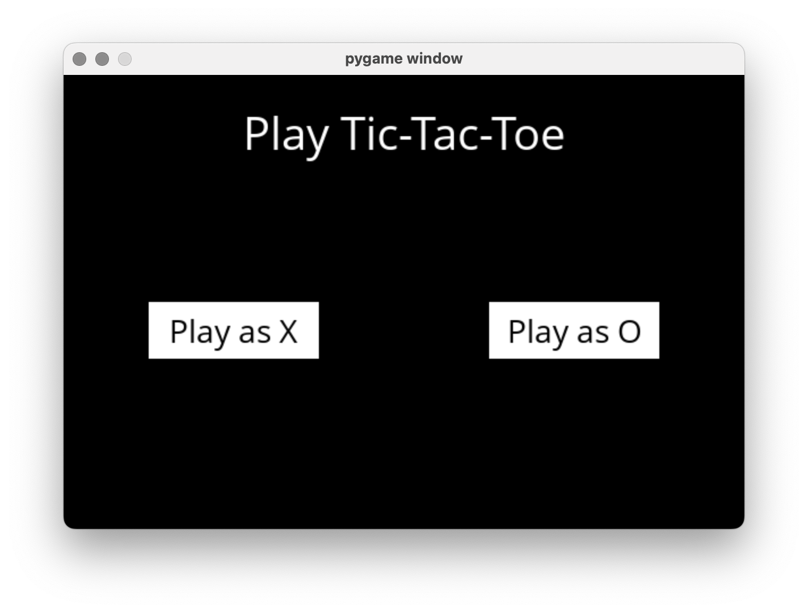

# Tic-Tac-Toe with Pygame and Minimax Algorithm

This project implements a simple game of Tic-Tac-Toe using the Pygame library. You can play against an AI opponent that makes optimal moves using the minimax algorithm.



## Table of Contents

- [Prerequisites](#prerequisites)
- [Installation](#installation)
- [How to Play](#how-to-play)
- [AI Opponent](#ai-opponent)


## Prerequisites

To run this project, you'll need the following:

- Python 3.x
- Pygame library (already included in the project)

## Installation

1. Clone the repository to your local machine:

   ```bash
   git clone https://github.com/your-username/tic-tac-toe-pygame.git

## How to Play
   - use runner.py to open game 
   - When you run the game, you'll be presented with a menu to choose your player: "X" or "O". Click on the respective buttons to select.
   - The game board will appear, and you can take turns to make your moves by clicking on an empty cell.
   - The AI opponent (if you didn't choose it as your player) will also make moves using the minimax algorithm.
   - The game will continue until there is a winner or a tie. The result will be displayed at the top of the game window.
   - You can play again by clicking the "Play Again" button after the game ends.
## AI Opponent
  - The AI opponent uses the minimax algorithm to make optimal moves. It considers all possible moves and selects the best one to maximize its chances of winning or minimizing the chances of losing. You can try to beat the AI in this classic game!


  


